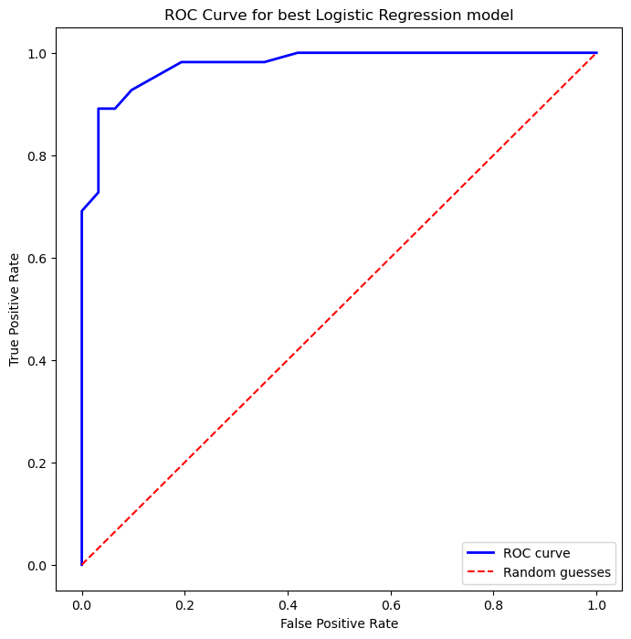
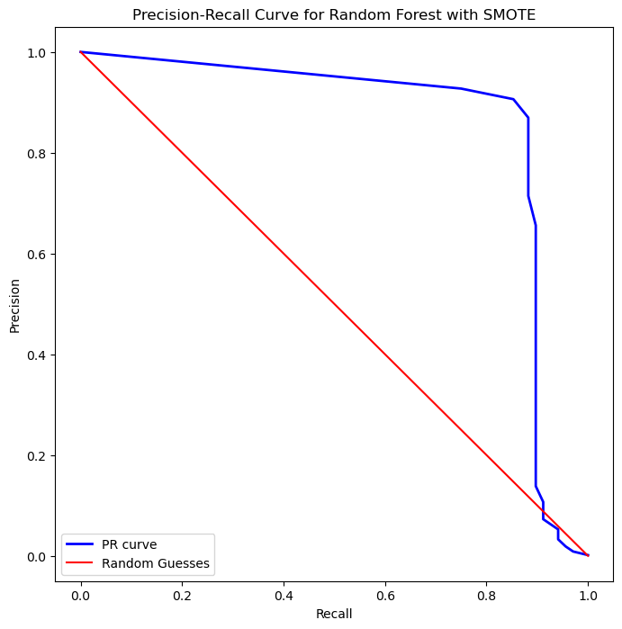
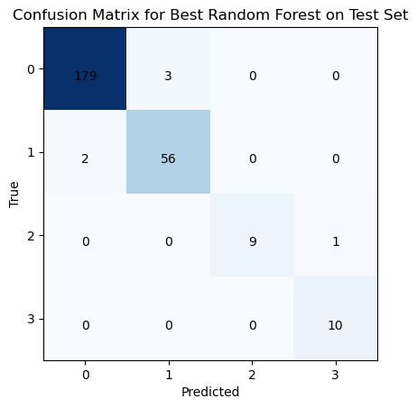

# ML Classification Models from Scratch
This repository contains the solutions to the third practical assignment for the course "I302 - Machine Learning and Deep Learning" for the first semester of 2024.
Three problems were considered and solved in different folders, where a python file contains the classes and functions used and the jupyter notebook file shows the main code and results.

## Table of Contents

- [Introduction](#introduction)
- [Problem Descriptions](#problem-descriptions)
  - [1. Breast Cancer Diagnosis](#1-breast-cancer-diagnosis)
  - [2. Credit Card Fraud Detection](#2-credit-card-fraud-detection)
  - [3. Vehicle Acceptance Evaluation](#3-vehicle-acceptance-evaluation)
- [Results](#results)
  - [Breast Cancer Diagnosis](#breast-cancer-diagnosis-results)
  - [Credit Card Fraud Detection](#credit-card-fraud-detection-results)
  - [Vehicle Acceptance Evaluation](#vehicle-acceptance-evaluation-results)

## Introduction

This repository contains a collection of Jupyter Notebooks and Python scripts developed for the third practical assignment of the "I302 - Machine Learning and Deep Learning" course. 
The assignment involves solving three different machine learning problems using various algorithms and techniques. 
These algorithms are all programmed from scratch, using only libraries as numpy and pandas.
The datasets for each problem are provided and split into training, validation, and testing sets.

## Problem Descriptions

### 1. Breast Cancer Diagnosis

The goal is to develop models to classify breast masses as benign or malignant based on features extracted from digital biopsy images. The models developed include:

- Linear Discriminant Analysis (LDA)
- K-Nearest Neighbors (KNN)
- Logistic Regression with L2 regularization

For each model, the following performance metrics are evaluated:

- Confusion Matrix
- Accuracy
- Precision
- Recall
- ROC Curve and AUC-ROC

### 2. Credit Card Fraud Detection

The aim is to classify credit card transactions as fraudulent or non-fraudulent. The models implemented include:

- Dense Neural Network
- Random Forest

The models are evaluated using the following techniques and metrics:

- Confusion Matrix
- Accuracy
- Precision
- Recall
- ROC Curve and AUC-ROC
- Precision-Recall Curve and AUC-PRC

Additionally, various rebalancing techniques are applied to handle class imbalance, such as:

- Undersampling
- Oversampling by duplication
- Cost re-weighting
- SMOTE (Synthetic Minority Oversampling Technique)

### 3. Vehicle Acceptance Evaluation

3. Vehicle Acceptance Evaluation
The objective is to predict the acceptance level of vehicles based on attributes such as price, maintenance cost, number of doors, passenger capacity, trunk size, and estimated safety. The models developed include:

- K-Nearest Neighbors (KNN)
- Decision Tree
- Random Forest

For each model, the following performance metrics are evaluated (SMOTE was considered as a rebalancing technique):

- Confusion Matrix
- Accuracy
- Precision for Class 0 ("unacceptable") and Class 3 ("very good")

## Results
One result for each problem is shown here.

### Breast Cancer Diagnosis Results

### Credit Card Fraud Detection Results

### Vehicle Acceptance Evaluation Results

